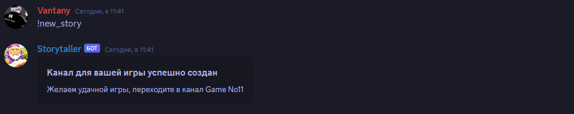
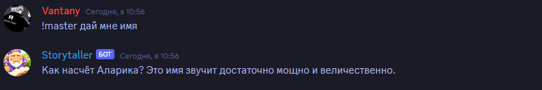
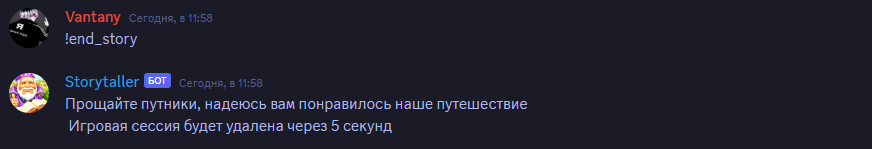

# Бот для проведения настольных игр
На данный момент бот предстовляет собой помощника в мире проведения настольнывх игр, доступна одна игра - Dungeon and Dragons, с возможностью расширения колличества игр. Игры проводятся с помощью giga chat

**Для написания был использован следующий стек разработки:**
    
    - Python, с библиотеками Discord py, gigachain
    - Api платформы Fusion brain, для использования нейросети Kandinsky
    - использования библиотеки asyncio для корректной работы ассинхронных функций
    - база данных postgreSQL для хранения информации о играх

**На данный момент у бота доступны некоторые команды**

    - new_story - создает новый текстовый канал в категории "Игры", после чего в этом канале начинается игровая сессия
    - master - для того чтобы обратиться к боту, тобеж мастеру проведения игры, эта команда в категории "Игры" позволяет продолжить игровую сессию, введя определенный запрос непосредственно мастеру
    - end_story - заканчивает игровую сессию и удаляет текстовый канал, где она проводилась, также удаляя все данные о прошедшей сессии из базы данных
    - export_story - позволяет экспортировать историю из конкретной игры в txt документ
    - info - дает информацию о доступных командах

**Демонстрация работы добавления новой истории**

**Демонстрация запроса боту**

**Демоестрация окончания сессии**

